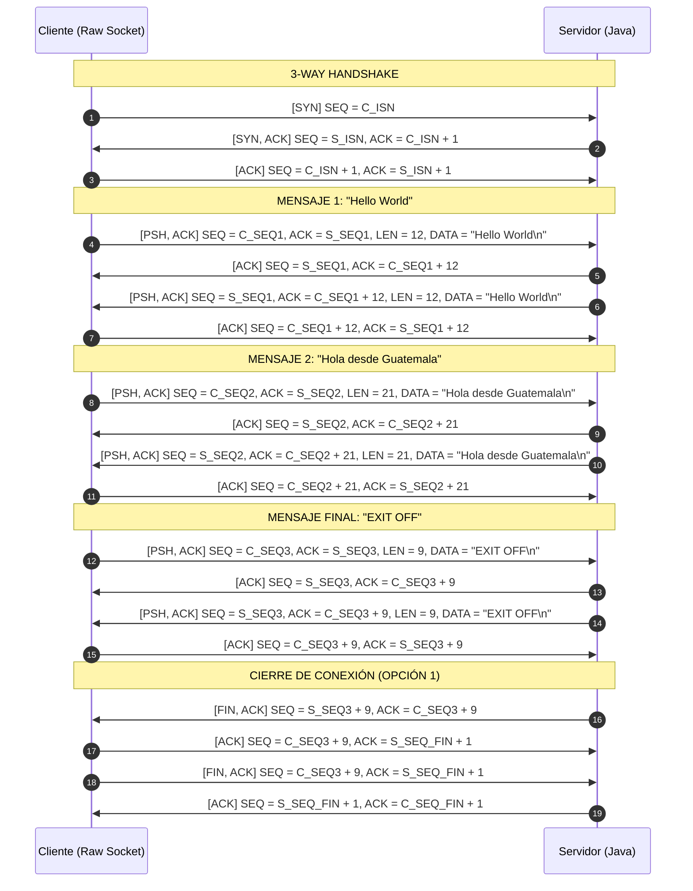

# Laboratorio: Cliente TCP con Raw Sockets
**Modificación, Análisis y Visualización de una Sesión TCP**

---

## 1. Resumen Ejecutivo y Objetivos

El presente laboratorio consistió en la modificación y extensión de un cliente TCP implementado en lenguaje C utilizando **Raw Sockets** (`SOCK_RAW`, `IPPROTO_TCP`) que construye manualmente los encabezados IPv4 y TCP. El objetivo central fue:
1. **Requerimiento 1**: Permitir al usuario interactuar en tiempo real con el cliente para enviar **N mensajes personalizados** (por ejemplo: `"Hello World"`, `"Hola desde Guatemala"`) en la misma conexión TCP, finalizando ordenadamente cuando se ingresa `"EXIT OFF"`.
2. **Requerimiento 2**: Mejorar el **output de consola** para mostrar de forma clara y estructurada los datos más relevantes de cada segmento TCP participante:
   - Emisor y Receptor (`Client → Server`, `Server → Client`).
   - Banderas TCP (`Flags`: SYN, ACK, PSH, FIN).
   - Número de Secuencia (`SEQ`).
   - Número de Reconocimiento (`ACK`).
   - Longitud de datos (`LEN`).
   - Carga útil (`DATA`).
3. **Validación del Cierre**: Identificar y justificar técnicamente qué opción de cierre realiza el sistema.
4. **Validación en Wireshark**: Demostrar la correspondencia exacta 1:1 entre los paquetes observados en la consola y la captura en Wireshark.

---

## 2. Validación de la Opción de Cierre de Conexión

### Pregunta del Laboratorio
> *¿Qué opción de cierre de conexión está realizando el código proporcionado?*

### Comparativa de Opciones:
* **Opción 1** (Iniciada por el Servidor):
  8. Servidor → Cliente : `FIN + ACK`
  9. Cliente → Servidor : `ACK`
  10. Cliente → Servidor : `FIN + ACK`
  11. Servidor → Cliente : `ACK`

* **Opción 2** (Iniciada por el Cliente):
  8. Cliente → Servidor : `FIN + ACK`
  9. Servidor → Cliente : `ACK`
  10. Servidor → Cliente : `FIN + ACK`
  11. Cliente → Servidor : `ACK`

### Demostración y Justificación Técnica:
El código proporcionado implementa la **Opción 1**.

**Justificación basada en el código fuente:**
1. **Comportamiento del Servidor (`ServerTCP.java`)**:
   En `ServerTCP.java`, el bucle de procesamiento evalúa:
   ```java
   msg = in.readLine();
   out.println(msg);
   System.out.println("Message: " + msg);
   if (msg.contains("EXIT")) { break; }
   ```
   Al cumplirse `msg.contains("EXIT")`, se rompe el ciclo y se ejecuta de inmediato:
   ```java
   client.close();
   ```
   Al invocar `client.close()`, el kernel del sistema operativo donde corre el servidor Java es el primero en enviar un segmento TCP con las banderas `FIN + ACK` hacia el cliente.
2. **Comportamiento del Cliente (`tcp_session.c`)**:
   El cliente recibe dicho segmento `FIN + ACK` del servidor, le envía un `ACK` de respuesta (paso 9), posteriormente el cliente envía su propio segmento `FIN + ACK` (paso 10) y finalmente el servidor responde con un `ACK` (paso 11).
3. **Conclusión**: El cierre es iniciado activamente por el servidor tras procesar el mensaje con `"EXIT"`, ejecutando estrictamente la **Opción 1**.

---

## 3. Trabajo Realizado por Fases

### Fase 1: Análisis y Diagnóstico del Código Base
* **Inspección del Handshake y Sesión**: Se analizó el flujo de armado de paquetes IP (`ip_header.c`) y TCP (`tcp_header.c`), el cálculo de checksums (`checksum.c`) y el envío/recepción raw (`raw_socket.c`).
* **Diagnóstico de Limitaciones**:
  1. El cliente original enviaba una única cadena fija (`"EXIT OFF"`) y de inmediato pasaba a esperar el cierre (`tcp_session_drain_until_close`). No existía mecanismo para que el usuario introdujera mensajes arbitrarios ni para mantener la conexión abierta intercambiando múltiples mensajes.
  2. En `tcp_session_drain_until_close`, la condición `if (payload_len == 0 && !has_fin) continue;` descartaba silenciosamente el segmento de confirmación `ACK` puro enviado por el kernel del servidor tras recibir los datos, omitiéndolo de la consola.
  3. La consola únicamente imprimía mensajes de depuración genéricos (`[*] Sending SYN...`, `[*] Server response: ...`) sin visibilidad de los números `SEQ`, `ACK`, `LEN` ni `Flags`.

---

### Fase 2: Implementación del Requerimiento 2 (Output Estructurado de Consola)
Para satisfacer el formato solicitado en la guía, se diseñaron e integraron las siguientes capacidades:
1. **Función de Formateo de Banderas (`format_tcp_flags`)**:
   Traduce el byte de flags TCP a una representación en texto estándar: `[SYN]`, `[SYN, ACK]`, `[ACK]`, `[PSH, ACK]`, `[FIN, ACK]`, etc.
2. **Función de Registro de Segmentos (`tcp_log_segment`)**:
   Formatea cada segmento con espaciado tabular claro:
   ```
   Dirección         Flags        SEQ         ACK         LEN    DATA
   Client → Server   [PSH, ACK]   SEQ=1001    ACK=5001    LEN=9  DATA="EXIT OFF\n"
   ```
   Los caracteres no imprimibles y saltos de línea dentro de `DATA` son escapados como `\n`, `\r`, `\t`, asegurando que la salida sea perfectamente legible en una sola línea por paquete.
3. **Señalizadores Visuales de Fase**:
   - Inicio: `════════════════════ TCP SESSION ════════════════════`
   - Datos: `──────────────────── DATA ──────────────────────────`
   - Cierre: `──────────────────── CLOSE ─────────────────────────`
   - Término: `══════════════════ CONNECTION CLOSED ═══════════════`
4. **Visibilidad Total de la Secuencia**: Ahora se captura y muestra el `ACK` puro que envía el servidor antes de emitir su eco (paso 5 de la secuencia).

---

### Fase 3: Implementación del Requerimiento 1 (Mensajes Personalizados y Soporte para N Mensajes)
1. **Bucle Interactivo de Consola (`tcp_client.c`)**:
   - Si no se pasa un mensaje estático por `-m`, el cliente inicia la sesión, completa el handshake y entra a un bucle interactivo que solicita:
     ```
     Ingrese un mensaje: 
     ```
   - El usuario puede teclear cualquier texto (ej. `"Hello World"`, `"Hola desde Guatemala"`).
   - El cliente añade automáticamente el salto de línea `\n` requerido por el `BufferedReader.readLine()` de Java.
2. **Sincronización Dinámica de SEQ y ACK**:
   - Cada mensaje enviado por el cliente avanza `s->seq += strlen(mensaje)`.
   - Al recibir el eco del servidor, `s->ack` avanza según los bytes recibidos (`s->ack += payload_len`).
   - El cliente responde con un `ACK` confirmando el eco.
   - La sesión permanece en estado **ESTABLISHED**, lista para recibir el siguiente mensaje.
3. **Manejo del Cierre Ordenado**:
   - Al ingresar `"EXIT"` o `"EXIT OFF"`, el servidor Java procesa la cadena, envía el eco y ejecuta `client.close()`.
   - El cliente detecta la bandera `FIN`, avanza `s->ack++`, emite el `ACK` correspondiente, envía su propio `FIN+ACK` (`s->seq++`), recibe el último `ACK` del servidor y cierra el socket raw.
4. **Nueva Opción `-c / --client-port`**:
   - Se añadió el argumento para permitir fijar el puerto local del cliente (ej. `-c 45000`).
   - Esto simplifica enormemente la configuración de la regla de `iptables` en Linux, permitiendo reutilizar la misma regla sin tener que reconfigurarla ante cada puerto efímero aleatorio.

---

### Fase 4: Pruebas y Validación con Wireshark
* Se levantó `ServerTCP` en el puerto 5001.
* Se configuró la regla de iptables para descartar los RST salientes del kernel.
* Se ejecutó el cliente enviando múltiples mensajes interactivos.
* Se verificó con Wireshark la coincidencia exacta de los 11 pasos del protocolo.

---

## 4. Guía de Ejecución Paso a Paso

### 4.1. Compilación
En la carpeta raíz del proyecto o dentro de `ClientTCP/`:

```bash
# Compilar el servidor Java
javac ServerTCP.java

# Compilar el cliente C con Raw Sockets
cd ClientTCP
make clean && make
cd ..
```

### 4.2. Configuración del Firewall (Bloqueo de RST del Kernel)
Dado que el cliente construye los paquetes TCP manualmente mediante raw sockets, el kernel del sistema operativo desconoce la conexión y genera automáticamente un paquete `RST` al recibir el `SYN+ACK`. Para evitar que el kernel aborte la sesión:

**Opción A: Puerto fijo con `-c` (Recomendado)**
```bash
# Permite fijar por ejemplo el puerto 45000
sudo iptables -A OUTPUT -p tcp --sport 45000 --tcp-flags RST RST -j DROP
```

**Opción B: Eliminar la regla al terminar las pruebas**
```bash
sudo iptables -D OUTPUT -p tcp --sport 45000 --tcp-flags RST RST -j DROP
```

### 4.3. Ejecución de las Pruebas

#### Terminal 1: Iniciar el Servidor
```bash
java ServerTCP
```
*Salida esperada:*
```
Server Port: 5001 on 0.0.0.0/0.0.0.0
```

#### Terminal 2: Iniciar la Captura en Wireshark / tcpdump
En Wireshark, seleccionar la interfaz de loopback (`lo`) y aplicar el filtro de visualización:
```
tcp.port == 5001
```

O en terminal mediante `tcpdump`:
```bash
sudo tcpdump -i lo -nn "tcp port 5001"
```

#### Terminal 3: Ejecutar el Cliente Interactivo
```bash
sudo ClientTCP/tcp_client -c 45000
```

*Interacción:*
```
[*] Puerto local cliente: 45000
[*] Regla iptables recomendada para evitar RST del kernel:
    sudo iptables -A OUTPUT -p tcp --sport 45000 --tcp-flags RST RST -j DROP

════════════════════ TCP SESSION ════════════════════
Client → Server   [SYN]        SEQ=1804289383
Server → Client   [SYN, ACK]   SEQ=3489201402 ACK=1804289384
Client → Server   [ACK]        SEQ=1804289384 ACK=3489201403
──────────────────── DATA ──────────────────────────

Ingrese un mensaje: Hello World
Client → Server   [PSH, ACK]   SEQ=1804289384 ACK=3489201403 LEN=12 DATA="Hello World\n"
Server → Client   [ACK]        SEQ=3489201403 ACK=1804289396
Server → Client   [PSH, ACK]   SEQ=3489201403 ACK=1804289396 LEN=12 DATA="Hello World\n"
Client → Server   [ACK]        SEQ=1804289396 ACK=3489201415

Ingrese un mensaje: Hola desde Guatemala
Client → Server   [PSH, ACK]   SEQ=1804289396 ACK=3489201415 LEN=21 DATA="Hola desde Guatemala\n"
Server → Client   [ACK]        SEQ=3489201415 ACK=1804289417
Server → Client   [PSH, ACK]   SEQ=3489201415 ACK=1804289417 LEN=21 DATA="Hola desde Guatemala\n"
Client → Server   [ACK]        SEQ=1804289417 ACK=3489201436

Ingrese un mensaje: EXIT OFF
Client → Server   [PSH, ACK]   SEQ=1804289417 ACK=3489201436 LEN=9 DATA="EXIT OFF\n"
Server → Client   [ACK]        SEQ=3489201436 ACK=1804289426
Server → Client   [PSH, ACK]   SEQ=3489201436 ACK=1804289426 LEN=9 DATA="EXIT OFF\n"
Client → Server   [ACK]        SEQ=1804289426 ACK=3489201445
──────────────────── CLOSE ─────────────────────────
Server → Client   [FIN, ACK]   SEQ=3489201445 ACK=1804289426
Client → Server   [ACK]        SEQ=1804289426 ACK=3489201446
Client → Server   [FIN, ACK]   SEQ=1804289426 ACK=3489201446
Server → Client   [ACK]        SEQ=3489201446 ACK=1804289427
══════════════════ CONNECTION CLOSED ═══════════════
```

---

## 5. Diagrama de Secuencia TCP Completo

A continuación se detalla el flujo de la sesión con N mensajes y cierre Opción 1:



---

## 6. Archivos Modificados

| Archivo | Modificaciones Realizadas |
|---|---|
| `tcp_session.h` | Inclusión de `local_port` en `tcp_session_open()`, declaración de `tcp_log_segment()`. |
| `tcp_session.c` | Implementación de `format_tcp_flags()`, `tcp_log_segment()`, captura no destructiva en `receive_next_tcp_packet()`, soporte para N mensajes con mantenimiento de SEQ/ACK y cierre Opción 1. |
| `tcp_client.h` | Incorporación del campo `client_port` en la estructura de opciones y `OPT_CLIENT_PORT`. |
| `tcp_client.c` | Incorporación del flag `-c / --client-port`, implementación del bucle interactivo `fgets` para N mensajes, e invocación a la secuencia visual de la sesión. |
| `README_Lab.md` | Documentación integral del laboratorio por fases, validación de cierre y guía para Wireshark. |
